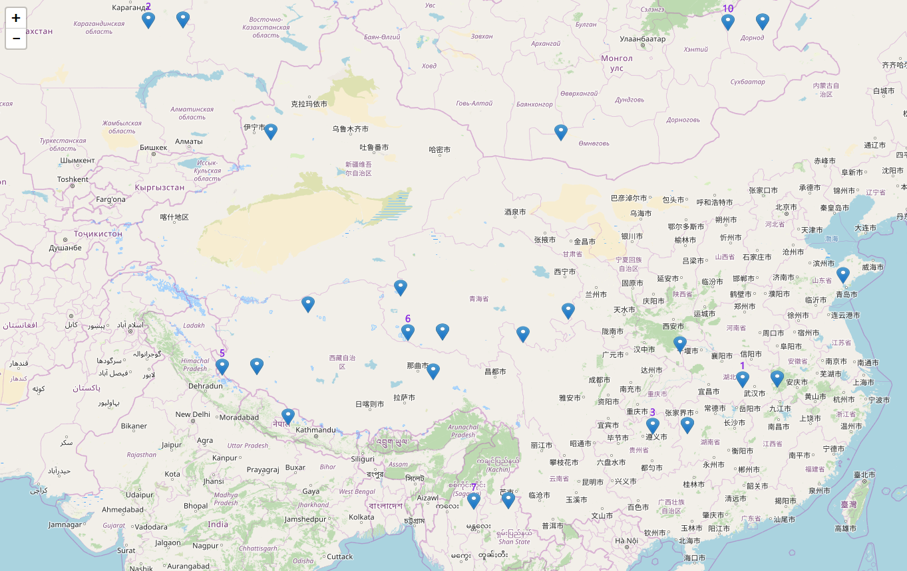

# leaflet-CanvasMarker
A plugin of canvas drawing marker


## Table of Contents
  * [Using the plugin](#using-the-plugin)
    * [Building](#building-scripts)
    * [Examples](#examples)
    * [Usage](#usage)
  * [Options](#options)
    * [Defaults](#defaults)
  * [License](#license)

## Using the plugin
Include the plugin JS files on your page after Leaflet files, using your method of choice:
* [Download the `v1.0.0` release](https://github.com/liubingreat/leaflet-CanvasMarker/archive/master.zip)
* Install with npm: `npm install leaflet.canvasMarker`

In each case, use file in the `dist` folder:
* `leaflet.Layer.CanvasMarker.js`


### Building-scripts
Install rollup `npm install rollup  -g` then run `npm install rollup --save-dev`
* To build leaflet.canvasMarker run `rollup -c build/rollup-config.js`

### Examples
See the included examples for usage.

* The [simple example](http://47.92.221.235/canvasMarker/example/demo.html)
* The [label example](http://47.92.221.235/canvasMarker/example/label-demo.html)

### Usage
Create a new CanvasMarker, then add your marker to the map

```javascript
var tiles = L.tileLayer('https://{s}.tile.openstreetmap.org/{z}/{x}/{y}.png', {
				maxZoom: 18,
				attribution: '&copy; <a href="https://www.openstreetmap.org/copyright">OpenStreetMap</a> contributors'
			}),
			latlng = new L.LatLng(34, 108);

		var map = new L.Map('map', {
						center: latlng,
						zoom: 5,
						layers: [tiles],
						preferCanvas: true
					});
		var marker = new L.CanvasMarker(latlng, {
					iconUrl: "https://unpkg.com/leaflet@1.0.3/dist/images/marker-icon-2x.png",
					iconWidth: 20,
					iconHeight: 26,
					graphic: true
				});
		map.addLayer(marker);
```

## Options
### Defaults
```javascript
	var options = {
	graphic: true,
	iconWidth: 30,
	iconHeight: 30,
	iconOffsetX: 0,
	iconOffsetY: 0,
	show: undefined,//show label set '1'
	title: undefined,//label name
	labelXOffset: 0,
	labelYOffset: 0,
	interactive: true
	};

```

## License
leaflet.layer.CanvasMarker is free software, and may be redistributed under the MIT-LICENSE.

